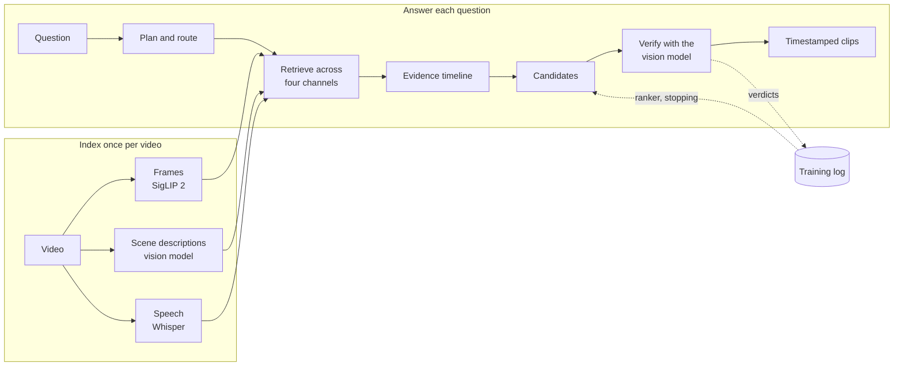

# Moments

[](https://github.com/eddierzhang/video_retrieval/actions/workflows/tests.yml)


**Ask a question about a video in plain English and get back timestamped clips - with every model
running on your own machine.**

> *"when does someone get out of the car?"* · *"who says 'thank you'?"* · *"read the license plate"*

Moments plans each question, searches frames, scene descriptions and speech in parallel, fuses the
evidence onto one timeline, checks the strongest candidates with a vision model, and cuts the matching
clips. No API key, no account, and no video leaves the computer.

Around that pipeline sits a small machine-learning system that improves it from its own output: a
benchmark whose answers are known by construction, tuned retrieval settings, learned clip boundaries,
a conformal candidate ranker, a self-supervised query adapter, and learned stopping policies trained by
replaying past searches.

## Highlights

- **Multimodal temporal retrieval.** Hierarchical chunking, SigLIP 2 frame embeddings scored by their
  best tile, vision-model scene descriptions, and semantic plus BM25 transcript search, fused with
  noisy-OR onto a shared evidence timeline from which the planner's confounders are subtracted.
- **Planning and routing.** One planner call decomposes a question into evidence predicates and channel
  weights, and routes it to event search or a dedicated text reader.
- **Ground truth without labeling.** `moments construct` splices indexed footage into new timelines and
  draws codes onto known frames, so every benchmark answer comes from an edit list, not a model.
- **Learning from the pipeline's own output.** Cross-validated tuning, learned boundaries, LambdaRank and
  ListNet ranking with split conformal prediction and exploration, contrastive query adaptation, and
  optimal stopping and fitted Q iteration over replayed searches - see [machine learning](docs/machine-learning.md).
- **Reproducible experiments.** Every benchmark and trainer records its arguments, seed, commit, input
  hashes and outputs, and any two runs can be compared.

## Results

Measured on constructed benchmarks, where the correct answer is known exactly. Held-out numbers are
cross-validated by timeline.

| What changed | Measure | Before | After |
| --- | --- | --- | --- |
| Tuned how quick search picks a moment | Held-out top-1 IoU, 113 events of 4-30 s | 0.337 | **0.432** |
| Learned clip boundaries | Boundary error on held-out timelines, simulated proposals | 2.9 s | **1.4 s** |
| Routing check for questions that name on-screen text | Queries routed to the right executor | 16 of 22 | **40 of 41** (18 of 18 held out) |

The numbers are honest about their limits: the benchmarks draw on a small pool of source footage, the
tuning gain is smallest for 8-15 second events, and several components are built and tested but still
waiting on enough logged searches to train. [Evaluation](docs/evaluation.md) covers the methodology and
the caveats in full.

## How it works



Quick searches skip verification and use tuned settings and learned boundaries instead, answering in
seconds. [Architecture](docs/architecture.md) walks through every stage.

## Quick start

Requirements: Python 3.11+, [FFmpeg](https://ffmpeg.org/download.html) on `PATH`, and
[Ollama](https://ollama.com/download).

```bash
git clone https://github.com/eddierzhang/video_retrieval.git
cd video_retrieval
python -m venv .venv
source .venv/bin/activate                  # Windows: .\.venv\Scripts\Activate.ps1
pip install torch --index-url https://download.pytorch.org/whl/cu126   # optional, NVIDIA GPUs
pip install -e ".[dev]"
ollama pull qwen3.5:4b && ollama pull nomic-embed-text
moments serve
```

On Windows, `.\start.ps1` starts Ollama, downloads the models on first run and opens the app.

Open <http://127.0.0.1:8765>, add a video, wait for it to index, and ask. **Quick** answers in seconds
from the indexes; **Verified** checks every candidate with the vision model and tightens the clip
boundaries. The *Query plan* tab shows how each question was decomposed and how many candidates
survived each stage.

## The `moments` command

```text
moments serve         Run the web app
moments benchmark     Score end-to-end retrieval against a labeled dataset
moments routing       Score how often the planner picks the right executor
moments runs          List, show and compare recorded experiment runs
moments construct     Build benchmark timelines whose answers are known
moments synthesize    Turn scene descriptions into pseudo-queries
moments tune          Cross-validated search over how quick mode picks a moment
moments boundaries    Train the clip boundary model
moments rank          Train the candidate ranker and its conformal set
moments distill       Train the pointwise candidate pre-filter
moments adapt         Train the self-supervised query adapter
moments replay        Replay logged searches to learn when to stop verifying
```

Every command takes `--help`. [Development](docs/development.md) has setup details, the library API and
the test suite.

## Documentation

| | |
| --- | --- |
| [Architecture](docs/architecture.md) | Every pipeline stage, the models, data on disk, security, design decisions |
| [Machine learning](docs/machine-learning.md) | Each learned component: technique, training signal, results and limits |
| [Evaluation](docs/evaluation.md) | Datasets, metrics, constructed benchmarks, routing and experiment tracking |
| [Development](docs/development.md) | Setup, the `moments` command, library use, project layout, tests |

## Limitations

Vision models see sampled frames and the transcript, not a native video stream, and a 4B local model
reads small text and reasons over long spans less well than a large hosted one. Brief actions and fine
temporal precision are the hardest cases. The server binds to loopback and has no authentication: it
is a single-user tool for your own machine.
