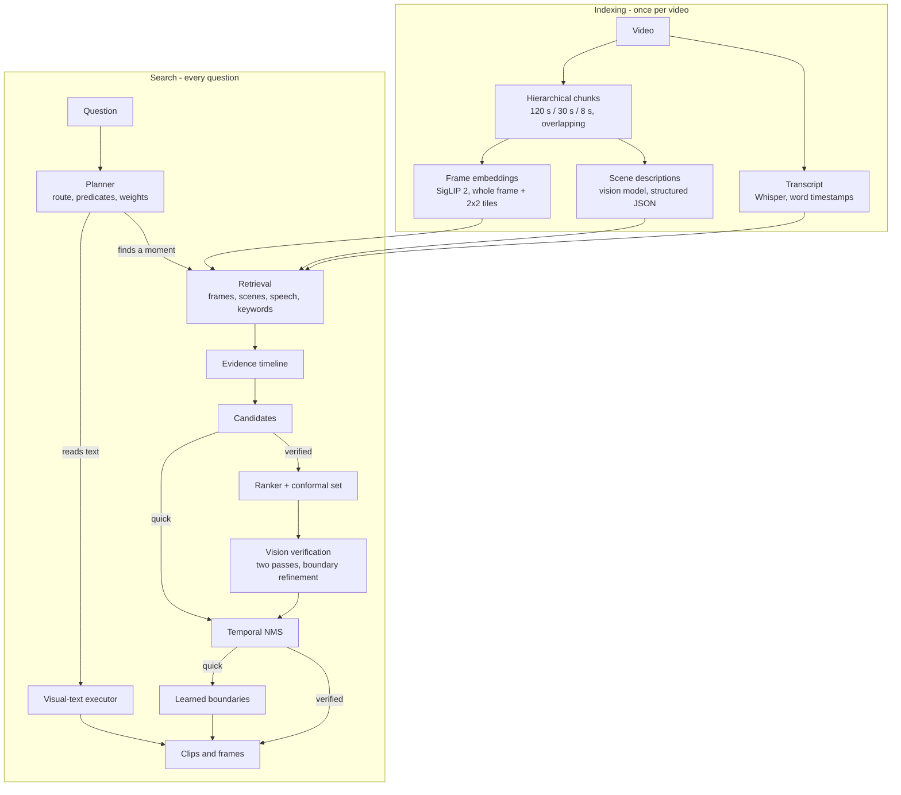

# Architecture

Moments answers a natural-language question about a video with timestamped clips. It works in two
stages: **indexing**, once per video, and **search**, once per question. Every model runs locally,
and every model call goes through one module, `video_retrieval/local_backend.py`, which is where
models are chosen, progress is reported and work is cancelled.

- [The pipeline at a glance](#the-pipeline-at-a-glance)
- [Indexing](#indexing)
- [Search](#search)
- [Models](#models)
- [Where the time goes](#where-the-time-goes)
- [Data on disk](#data-on-disk)
- [Security](#security)
- [Design decisions](#design-decisions)
- [Trade-offs](#trade-offs)

## The pipeline at a glance



## Indexing

Indexing runs once per video and is cached on disk, keyed by the file and by the settings that
change an index's contents. An interrupted index resumes from finished work.

### 1. Hierarchical chunking
The video is divided at three overlapping scales: coarse (120 s), medium (30 s on a 15 s stride) and
fine (8 s). Large chunks preserve the context needed to recognise an event; small ones localise it.
Retrieval moves from coarse to fine.

### 2. Frame embeddings
Frames are sampled once per second and embedded with SigLIP 2, which outperforms CLIP ViT-B/32 at a
similar size. Each frame is embedded five times: once whole, and once per tile of a 2x2 grid. The
model resizes whatever it is given to 224 px, so a detail occupying a tenth of a 4K frame is a
handful of pixels by the time it is seen; the tiles give that detail a view of its own. A chunk keeps
one vector per view, mean-pooled over its frames, and is scored against a query by its
**best-matching view**, so a match in one corner is not averaged away by three quiet ones. Each frame
is embedded once and reused at every scale.

### 3. Transcript
Audio is transcribed once with word-level timestamps and split into overlapping windows. Both
semantic search (a text embedder) and lexical search (BM25) run over it: embeddings catch paraphrase,
BM25 catches exact names and phrases. The semantic side uses a dedicated text embedder rather than
the image-text model, whose text tower is trained on short captions and capped well below the length
of a paragraph of speech.

### 4. Scene descriptions
Each medium chunk is described by the vision model as structured JSON - actions, people, objects,
state changes, visible text and search terms. The descriptions are embedded with the same text
embedder as the transcript and indexed separately, giving a second visual channel that does not
depend on the raw frame embedding. Because visible text is part of the description, a scene named by
the text in it ("the Exit sign above the door") can be found without reading the video again.

## Search

### 5. Planning and routing
One planner call decides which executor answers the question and decomposes it: per-channel queries,
4-12 atomic evidence predicates (each with a role, the channels that can retrieve it, whether it is
required and how discriminative it is), negative evidence, temporal constraints, an expected duration
and channel weights.

Routing decides between finding a **moment** and reading **text**. The costly mistake is sending a
moment to the text reader, so the planner applies one test - *does the user already state the
text?* - and a text route is confirmed with a second, narrow question. If the user wrote the words
themselves, the request is re-planned under a schema that only permits temporal grounding. See
[evaluation](evaluation.md#routing) for how that was measured.

### 6. Visual text
When the answer is a string of characters, a separate executor scans the video, re-reads the best
original-resolution frames and crops, and takes a consensus across readings.

### 7. Retrieval and the evidence timeline
Four channels search their indexes: frames, scene descriptions, speech meaning and speech wording.
Every hit is mapped onto a shared timeline. Scores are calibrated within each ranking first, because
a frame similarity and a BM25 score are not on the same scale. Within a query, overlapping hits
combine by noisy-OR, so agreement produces a peak rather than a plateau; channels are then mixed by
the planner's weights. The confounders the planner named are retrieved the same way and
**subtracted**, so a region that looks like the wrong thing scores lower rather than merely failing
to score higher.

### 8. Candidates
Connected regions of the timeline above a relative floor become candidates, ranked by peak score,
evidence mass and supporting bins. When a question needs one thing to happen before another,
candidates whose evidence peaks in that order are promoted. Promising regions can be recursively
subdivided toward the expected event length.

Everything from the evidence timeline to this point calls no model. It lives in
`pipeline.locate_candidates`, and the numbers that govern it live in `retrieval.DEFAULT_SCORING`,
which is what lets `moments tune` replay this stage thousands of times against benchmarks with known
answers. Tuned settings apply only to quick searches - see [machine learning](machine-learning.md#tuned-retrieval-settings).

### 9. Quick mode: learned boundaries
A quick search returns candidates without a vision call. After temporal NMS, a learned boundary model
moves each answer's start and end onto the step in per-second query similarity, in milliseconds.

### 10. Verified mode: selection and verification
Before any vision call, a trained ranker orders the candidates and a conformal threshold decides how
many to keep; one rejected candidate in ten is verified anyway, so future training data is not only
the ranker's own choices. Without a trained ranker, every candidate is verified.

The vision model then finds every distinct occurrence inside each candidate. A vision call spends a
fixed frame budget on whatever span it is handed, so candidates are split into short windows: at 12
frames, a 75-second window is one frame every six seconds, while a 25-second window is one every two.
A second, stricter pass re-checks each occurrence and rejects near misses, and boundaries are refined
by asking progressively shorter clips where the transition happens.

### 11. Output
Temporal NMS removes duplicates while preserving genuinely distinct actors, and FFmpeg cuts each
clip and its frames from the original video. Every result carries the plan, the evidence and a
funnel of how many candidates survived each stage.

## Models

| Role | Model |
| --- | --- |
| Planner, routing check | `qwen3.5:4b` via Ollama |
| Scene descriptions, first verification pass, boundary refinement, OCR | `qwen3.5:4b` (vision) |
| Second, stricter verification pass | `qwen3.5:4b` (configurable separately) |
| Frame embeddings | SigLIP 2 `google/siglip2-base-patch16-224`, whole frame plus 2x2 tiles |
| Scene and transcript embeddings | `nomic-embed-text` via Ollama |
| Speech transcription | faster-whisper `base`, with word timestamps |

One multimodal model fills every generative role by default, so the GPU never swaps models mid-search.
Any Ollama model with the `vision` capability can be substituted in the app's settings; the planner
slot accepts text-only models too.

Vision models see sampled frames plus the interval's transcript, not a native video stream. Sparse
frames and small local models reduce accuracy on brief actions, small text and fine temporal
precision compared with large hosted models.

## Where the time goes

Measured on an RTX 4080 SUPER with the CUDA build of PyTorch:

| Step | Time |
| --- | --- |
| Indexing a 21 s clip | 15 s |
| Indexing a 104 s clip with speech | 78 s |
| Indexing a 5:47 clip with speech | 157 s |
| Quick search | 7-20 s |
| Text-reading search | about 40 s on a short clip, a few minutes on a long one |
| Verified search | 40-130 s, depending on how many candidates survive |

Indexing cost is dominated by scene descriptions - about one vision call per 30 s of video - plus one
pass of frame embeddings (five views per frame) and one Whisper pass. Search cost is dominated by the
vision calls in verification, so it grows with the number of candidates, not with the length of the
video. That is why selecting candidates before verification is worth learning.

## Data on disk

Everything generated stays under `local_data/`, which is git-ignored:

```
local_data/library/<video id>/       source video, thumbnail, video.json
                    index/<hash>/    chunks, embeddings, transcript, scene descriptions
                    searches/<id>/   saved results with clips and frames
local_data/cache/                    frame embeddings and transcripts, keyed by file identity
local_data/learning/                 logged candidate outcomes and trained models
local_data/tuning_cache/             cached plans and retrieval hits for moments tune
local_data/constructed/              benchmark timelines built by moments construct
local_data/models/                   SigLIP and Whisper weights
```

Videos are content-addressed, so adding the same file twice reuses the existing entry. The index key
covers only what changes an index's contents, so swapping the planner or verifier does not force a
rebuild. Deleting a video in the app removes all of it.

## Security

The server binds to `127.0.0.1` and has no authentication: it is a single-user local tool. Requests
that change anything must carry an `X-Moments` header, which another website cannot send without a
CORS preflight this server never grants, and only loopback host names are accepted. Uploaded file
names are never used as paths, and files under a search are served only from inside that search's
own directory.

## Design decisions

1. **Hierarchical chunking.** Large chunks carry the context to recognise an event; small chunks give
   accurate timestamps. One fixed length could not do both.
2. **Separate retrieval channels.** Frames, scene descriptions, speech meaning and speech wording
   capture different evidence, so a question can lean on its strongest source instead of forcing
   everything through one model. Embeddings alone did not handle questions that needed reasoning.
3. **Semantic search plus BM25.** Embeddings find related content; BM25 is reliable for exact names
   and phrases.
4. **Evidence on a shared timeline.** Agreement between channels, visible as a peak, is more
   reliable than any single similarity score.
5. **Planning before retrieval.** Different parts of a question need visual, spoken, textual or
   temporal evidence, so the planner decomposes it rather than embedding it whole.
6. **Coarse-to-fine search.** Refining high-scoring coarse regions avoids fine-grained search across
   the whole video.
7. **Verification last.** Retrieval returns related clips that do not contain the event; checking the
   strongest candidates with the vision model removes those false positives.
8. **Index once, search many times.** Embeddings, descriptions, transcripts and indexes do not change
   between questions.
9. **A dedicated reader for text.** Reading characters is a different task from finding a moment, so
   it has its own executor rather than returning frames and leaving the reading to the user.
10. **One runtime boundary.** Every model call goes through `local_backend`, so models are swapped,
    progress reported and work cancelled in one place.
11. **Learned pieces are optional and inert until trained.** Every learned component falls back to
    the hand-written behaviour when its model file is absent, so a fresh checkout behaves predictably.

## Trade-offs

1. **Accuracy against computation.** More scales and channels give more evidence but cost indexing
   time, disk and GPU memory.
2. **Context against precision.** Long clips carry more context; short ones localise better.
3. **Indexing against latency.** Work done once per video keeps each question fast.
4. **General against specialised models.** Pretrained models need no annotation, but a task-specific
   model would likely do better at any single task.
5. **Local against hosted models.** Running locally removes API keys, costs and rate limits and keeps
   video private, at the price of a 4B model that reads small text and reasons over long contexts less
   well than a large hosted one.
